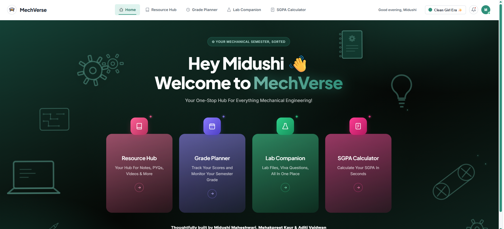
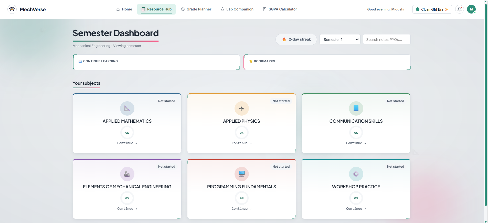
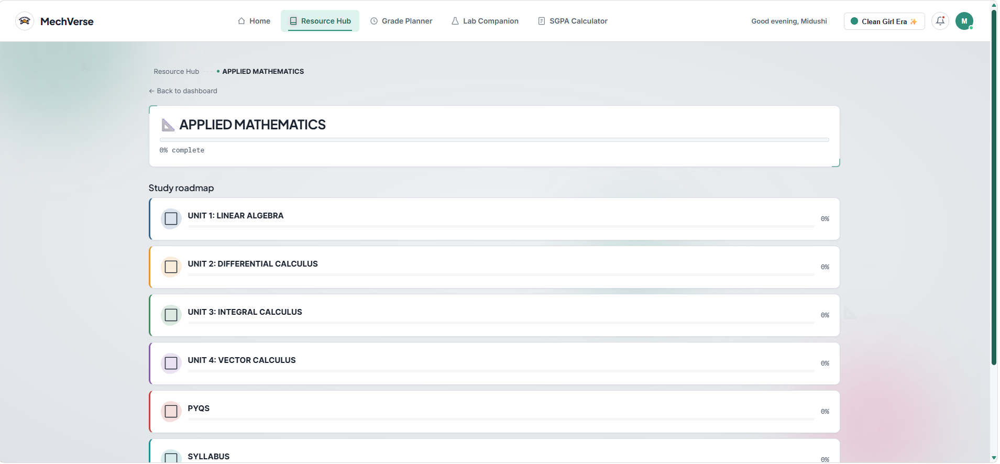
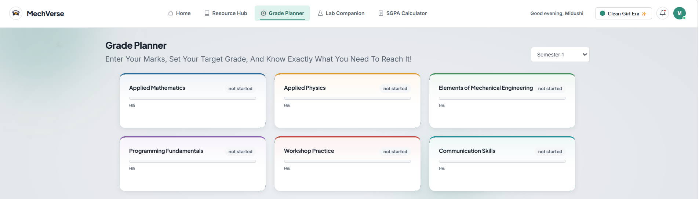
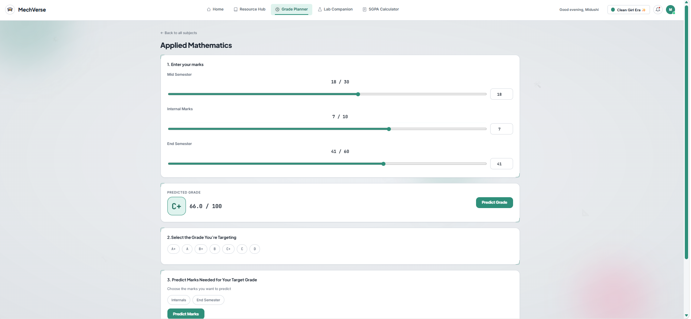
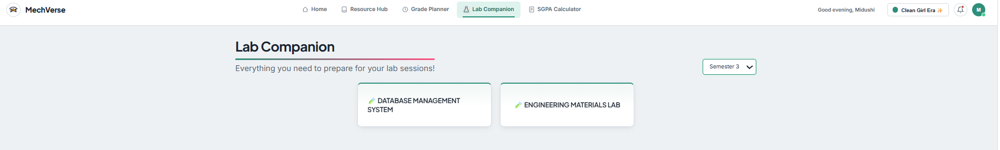
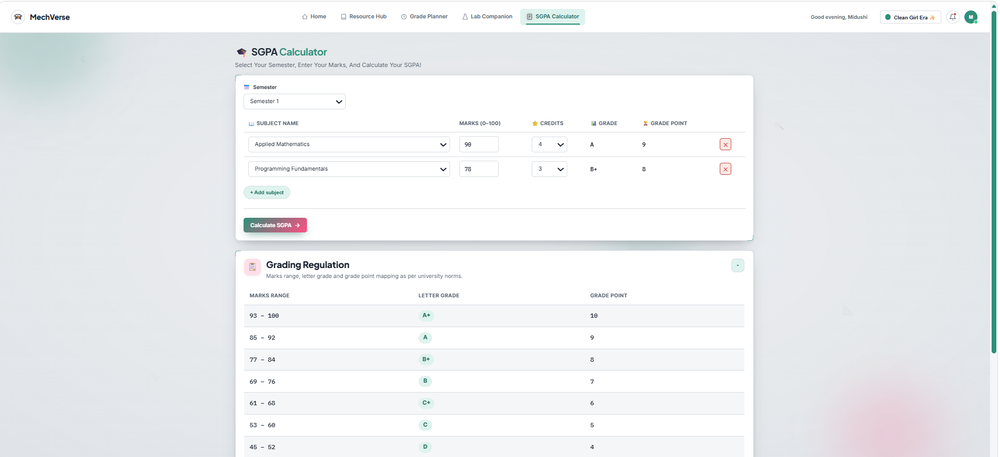

<div align="center">

# 🛠️ MechVerse

### Your Mechanical Semester, Sorted.

A one-stop academic companion for Mechanical Engineering students — curated study resources, a smart grade planner, lab preparation material, and an instant SGPA calculator, all in one place.

[](https://mechverse-igdtuw.vercel.app/)


**🌐 [mechverse-igdtuw.vercel.app](https://mechverse-igdtuw.vercel.app/)**



<em>The MechVerse landing page — four tools, one platform.</em>

</div>

---

## Table of Contents

1. [Overview](#1-overview)
2. [Problem Statement](#2-problem-statement)
3. [Key Features](#3-key-features)
4. [Application Walkthrough](#4-application-walkthrough)
5. [System Architecture](#5-system-architecture)
6. [Technology Stack](#6-technology-stack)
7. [Database Design](#7-database-design)
8. [API Reference](#8-api-reference)
9. [Security](#9-security)
10. [Repository Structure](#10-repository-structure)
11. [Getting Started (Local Setup)](#11-getting-started-local-setup)
12. [Environment Variables](#12-environment-variables)
13. [Available Scripts](#13-available-scripts)
14. [Data Migration](#14-data-migration)
15. [Deployment](#15-deployment)
16. [Content Management (Admin Panel)](#16-content-management-admin-panel)
17. [Limitations](#17-limitations)
18. [Future Work](#18-future-work)
19. [Authors](#19-authors)
20. [License](#20-license)

---

## 1. Overview

**MechVerse** is a full-stack web platform built for Mechanical Engineering students at **IGDTUW**. It brings together everything a student needs during a semester — notes, previous-year question papers (PYQs), videos, syllabus, lab files, marks tracking, and grade calculation — behind a single, consistent and personalised interface.

The platform is organised around four core modules:

| Module | Purpose |
|---|---|
| 📚 **Resource Hub** | Semester-wise subjects with unit-wise notes, PYQs, videos and syllabus, plus progress tracking and bookmarks |
| 🗓️ **Grade Planner** | Enter marks, see the predicted grade, set a target grade, and find out exactly what marks are needed to reach it |
| 🧪 **Lab Companion** | Lab files and viva questions for every lab, organised by semester |
| 🧮 **SGPA Calculator** | Calculate SGPA in seconds using the university's grading regulation |

---

## 2. Problem Statement

Study material for a single semester is typically scattered across WhatsApp groups, Google Drive folders, seniors' hand-me-downs, and individual notebooks. Students also have to calculate their grade standing manually, without knowing how much they must score in the end-semester exam to reach a target grade.

MechVerse addresses this by providing:

1. **One organised home** for all semester resources, structured subject → unit → resource.
2. **A transparent grading tool** that converts raw marks into a predicted grade and works backwards from a target grade to the marks required.
3. **A lab-preparation space** so that lab files and viva questions are never hunting-and-searching affairs.
4. **A personalised experience** with progress tracking, bookmarks, a study streak, and selectable themes.

---

## 3. Key Features

### 📚 Resource Hub
- Semester selector (Semesters 1–8) with a **subject dashboard** per semester
- **Study roadmap** per subject: Unit 1 → Unit N, followed by **PYQs** and **Syllabus**
- Resource types include **notes, videos, and PYQs**, each linked to Google Drive or external sources
- **Per-resource progress tracking** with completion percentages rolled up at unit, subject and dashboard level
- **Continue Learning** shortcut for recently viewed units and subjects
- **Bookmarks** for quick access to saved resources
- **Global search** across notes and PYQs
- 🔥 **Study streak** counter to encourage consistent revision

### 🗓️ Grade Planner
- Per-subject assessment components: **Mid Semester (/30)**, **Internal Marks (/10)**, **End Semester (/60)**, and **Lab Practical Marks (/30)** where the subject has a lab
- Slider + numeric input for every component
- Instant **predicted letter grade** and total marks
- **Target grade selector** (A+ through D)
- **Reverse prediction** — choose Internals or End Semester and get the marks needed to hit the target
- Target and marks are saved per user and per course
- **Historical comparison** endpoint for benchmarking against earlier batches

### 🧪 Lab Companion
- Semester-wise list of labs
- Per-lab files and viva-question material served through shareable links
- Admin-managed — students always see the latest uploaded content

### 🧮 SGPA Calculator
- Choose a semester, select subjects, enter marks and credits
- Automatic **marks → letter grade → grade point** conversion
- Weighted SGPA computed on **Calculate SGPA**
- Built-in **Grading Regulation** reference table (marks range, letter grade, grade point)

### 🎨 Personalisation & Experience
- **Four themes:** Clean Girl Era ✨, Soft Girl Era 🎀, Baddie Era 🖤, and a fully customisable **Creator Era** 🎨 (pick your own background and accent colour)
- Time-aware greeting (*"Good evening, Midushi"*) and animated intro
- Notification bell, back-to-top button, and smooth responsive layouts

### 🔐 Accounts & Access
- Registration and login with JWT-based sessions
- **Forgot-password / reset-password** flow via email (Brevo)
- **Guest preview** — course, subject and lab listings are publicly visible; full content requires login
- **Role-based access** — admin accounts (configured by email) unlock the admin panel

---

## 4. Application Walkthrough

### 4.1 Home

The landing page greets the signed-in student and presents the four core modules as entry cards.

<p align="center">
  
</p>

### 4.2 Resource Hub — Semester Dashboard

A semester dropdown, a streak counter, and a search bar sit above the **Continue Learning** and **Bookmarks** shortcuts. Each subject card shows its progress ring and a *Continue* action.

<p align="center">
  
</p>

### 4.3 Resource Hub — Subject Roadmap

Opening a subject (here, **Applied Mathematics**) reveals a colour-coded **study roadmap**: units in order, followed by PYQs and Syllabus, each with its own progress bar.

<p align="center">
  
</p>

### 4.4 Grade Planner — Subject Selection

Every subject for the chosen semester appears as a card with its current completion status.

<p align="center">
  
</p>

### 4.5 Grade Planner — Predict & Plan

Marks are entered through sliders or number fields. The **predicted grade** updates immediately (for example, 18/30 + 7/10 + 41/60 = **66/100 → C+**). The student then selects a target grade and chooses whether to predict the **Internals** or **End Semester** marks required.

<p align="center">
  
</p>

### 4.6 Lab Companion

Labs are grouped by semester (shown here for Semester 3), each opening into its lab files and viva questions.

<p align="center">
  
</p>

### 4.7 SGPA Calculator

Subjects, marks and credits go in; letter grade and grade point are filled automatically. The **Grading Regulation** table below documents the university's marks-to-grade mapping.

<p align="center">
  
</p>

**Grading regulation used by the calculator**

| Marks range | Letter grade | Grade point |
|:---:|:---:|:---:|
| 93 – 100 | A+ | 10 |
| 85 – 92 | A | 9 |
| 77 – 84 | B+ | 8 |
| 69 – 76 | B | 7 |
| 61 – 68 | C+ | 6 |
| 53 – 60 | C | 5 |
| 45 – 52 | D | 4 |

```
SGPA = Σ (Grade Point × Credits) / Σ Credits
```

---

## 5. System Architecture

MechVerse follows a simple, deployment-friendly architecture: a static multi-page frontend and a single Express API served from the same origin.

```
┌──────────────────────────┐          ┌───────────────────────────────┐
│        Browser           │          │          Vercel               │
│  HTML · CSS · Vanilla JS │ ───────► │  Static files  (/frontend)    │
│  (frontend/)             │          │  /api/*  ──►  api/index.js    │
└──────────────────────────┘          │               (Express app)   │
                                      └───────────────┬───────────────┘
                                                      │
                          ┌───────────────────────────┼─────────────────────────┐
                          ▼                           ▼                         ▼
                 ┌─────────────────┐       ┌────────────────────┐    ┌────────────────────┐
                 │ Postgres (Neon) │       │    Google Drive    │    │   Brevo (email)    │
                 │ users, subjects │       │ notes · PYQs ·     │    │ password-reset &   │
                 │ marks, labs ... │       │ lab files (links)  │    │ welcome emails     │
                 └─────────────────┘       └────────────────────┘    └────────────────────┘
```

**Request flow**

1. The browser loads static pages directly from `frontend/`.
2. Pages call `/api/...` endpoints (the API base is configured in `frontend/js/config.js`).
3. `vercel.json` rewrites `/api/*` to the Express app wrapped in `api/index.js`.
4. Controllers read and write **Neon Postgres**; study files themselves live on **Google Drive**, with the admin pasting share links into the platform.

**Design decisions**

- **Same-origin deployment** — site and API share one address, so CORS and cookie handling stay simple.
- **Links over uploads** — files are stored on Google Drive and referenced by URL, keeping the database light and the hosting free-tier friendly.
- **No frontend framework** — plain HTML/CSS/JS keeps the site fast, dependency-free and easy for future contributors to understand.

---

## 6. Technology Stack

**Frontend**
HTML5 · CSS3 (custom design tokens and theming) · Vanilla JavaScript · Google Fonts

**Backend**
Node.js 22 · Express 4 · JSON Web Tokens (`jsonwebtoken`) · `bcryptjs` · `express-validator` · `express-rate-limit` · `helmet` · `cors` · `cookie-parser` · `dotenv`

**Database**
PostgreSQL hosted on **Neon** (via `pg`), with a one-time migration path from the original SQLite version

**Services & Hosting**
Vercel (hosting and serverless API, `sin1` region) · Brevo (transactional email) · Google Drive (file storage) · Google Apps Script (Drive file listing helper)

---

## 7. Database Design

The schema is defined in `backend/src/config/schema.js` and created with `npm run db:init`.

| Domain | Tables |
|---|---|
| **Authentication** | `users`, `password_reset_tokens` |
| **Resource Hub** | `subjects`, `units`, `resources`, `resource_progress`, `bookmarks`, `recently_viewed`, `recently_viewed_subjects` |
| **Grade Planner** | `courses`, `assessment_components`, `student_marks`, `grade_targets`, `historical_records` |
| **Lab Companion** | `labs`, `lab_files` |

**Relationships (simplified)**

```
subjects ──< units ──< resources ──< resource_progress >── users
                          │                                   │
                          └──────< bookmarks >────────────────┤
                                                              │
courses ──< assessment_components ──< student_marks >─────────┤
   └──< grade_targets >───────────────────────────────────────┘

labs ──< lab_files
```

Cascading deletes keep data consistent: removing a subject removes its units and resources, and removing a user removes their progress, bookmarks, marks and targets.

---

## 8. API Reference

All endpoints are prefixed with `/api`. Routes marked 🔒 require login and 🛡️ require an admin account.

### Authentication — `/api/auth`

| Method | Endpoint | Access | Description |
|---|---|---|---|
| POST | `/register` | Public | Create an account |
| POST | `/login` | Public | Sign in |
| POST | `/logout` | Public | Sign out |
| GET | `/me` | 🔒 | Current user profile |
| POST | `/forgot-password` | Public | Email a password-reset link |
| POST | `/reset-password` | Public | Set a new password using the reset token |

### Resource Hub — `/api/resource-hub`

| Method | Endpoint | Access | Description |
|---|---|---|---|
| GET | `/subjects` | Public | Subject list (guest preview) |
| GET | `/type-counts` | Public | Resource counts by type |
| GET | `/subjects/:subjectId` | 🔒 | Subject with units and resources |
| GET | `/units/:unitId` | 🔒 | Unit detail |
| GET | `/search` | 🔒 | Search notes and PYQs |
| GET | `/by-type` | 🔒 | Filter resources by type |
| GET | `/bookmarks` | 🔒 | Bookmarked resources |
| GET | `/recently-viewed` | 🔒 | Continue-learning data |
| POST | `/resources/:id/progress` | 🔒 | Toggle completion |
| POST | `/resources/:id/bookmark` | 🔒 | Toggle bookmark |
| POST / PATCH / DELETE | subjects, units, resources | 🛡️ | Admin content management and reordering |

### Grade Planner — `/api/grade-planner`

| Method | Endpoint | Access | Description |
|---|---|---|---|
| GET | `/courses` | Public | Course list (guest preview) |
| GET | `/courses/:courseId/historical` | 🔒 | Historical batch comparison |
| POST | `/marks` | 🔒 | Save marks for a component |
| POST | `/target` | 🔒 | Save a target percentage for a course |

### Lab Companion — `/api/lab-companion`

| Method | Endpoint | Access | Description |
|---|---|---|---|
| GET | `/labs` | Public | Lab list (guest preview) |
| GET | `/labs/:labId` | 🔒 | Lab with its files |
| POST / PATCH / DELETE | `/labs`, `/lab-files` | 🛡️ | Admin lab and file management |

### Health

| Method | Endpoint | Description |
|---|---|---|
| GET | `/api/health` | Returns `{ "ok": true }` |

---

## 9. Security

| Concern | Measure |
|---|---|
| Password storage | Hashed with **bcrypt** (`bcryptjs`) — plain-text passwords are never stored |
| Sessions | Signed **JWT** with configurable expiry (`JWT_EXPIRES_IN`) |
| Reset tokens | Only a **hash** of the reset token is stored; tokens expire and are single-use |
| Input validation | `express-validator` rules on every write endpoint |
| Brute-force protection | Dedicated rate limiter on auth routes (200 requests / 15 min) and a general API limiter (200 requests / min) |
| HTTP hardening | `helmet` security headers |
| Authorisation | `requireAuth` / `requireAdmin` middleware; admins are defined via the `ADMIN_EMAILS` environment variable |
| Secrets | All credentials live in environment variables — `.env` is never committed |
| Error handling | Centralised handler returns generic messages and never leaks stack traces |

---

## 10. Repository Structure

```
mechverse/
│
├── api/
│   └── index.js                  Vercel entry point (wraps the Express app)
│
├── frontend/                     The website, served as-is
│   ├── index.html                Sign in / register
│   ├── intro.html                Animated wordmark intro
│   ├── home.html                 Landing page
│   ├── dashboard.html            Resource Hub — semester dashboard
│   ├── subject.html              Subject study roadmap
│   ├── unit.html                 Unit resources
│   ├── grade-planner.html        Grade Planner
│   ├── lab-companion.html        Lab Companion
│   ├── sgpa-calculator.html      SGPA Calculator
│   ├── admin.html                Admin panel (add / edit content)
│   ├── reset-password.html       Password reset
│   ├── assets/                   Logo, favicon and README screenshots
│   ├── css/style.css             Global styles and design tokens
│   └── js/
│       ├── api.js                API client
│       ├── config.js             API base URL + favicon
│       ├── nav.js                Shared navigation bar
│       ├── theme.js              Four-theme system + Creator Era
│       ├── streak.js             Daily study streak
│       ├── sgpa.js               SGPA calculation logic
│       ├── ui-helpers.js         Shared UI utilities
│       ├── back-to-top.js        Scroll-to-top button
│       └── wordmark-intro.js     Intro animation
│
├── backend/
│   ├── src/
│   │   ├── app.js                Express app (middleware + routes)
│   │   ├── server.js             Local server entry
│   │   ├── config/               Database connection and schema
│   │   ├── controllers/          auth, resource, grade, lab logic
│   │   ├── routes/               Route definitions
│   │   ├── middleware/           auth, validation, rate limiting, upload
│   │   ├── utils/                asyncHandler, mailer
│   │   └── seed/seed.js          Sample data
│   ├── scripts/                  init-db and migration scripts
│   └── .env.example              Environment variable template
│
├── tools/
│   └── list-drive-files.gs       Google Drive file-listing helper
│
├── vercel.json                   Hosting, redirects and API rewrites
├── package.json
└── README.md
```

---

## 11. Getting Started (Local Setup)

### Prerequisites

- **Node.js 22.x** and npm
- A free **[Neon](https://neon.tech)** Postgres database
- *(Optional)* a **[Brevo](https://www.brevo.com)** account for password-reset emails

### Steps

**1. Clone the repository**

```bash
git clone https://github.com/<your-username>/mechverse.git
cd mechverse
```

**2. Install dependencies**

```bash
npm install
```

**3. Create your environment file**

```bash
# Windows
copy backend\.env.example backend\.env

# macOS / Linux
cp backend/.env.example backend/.env
```

Open `backend/.env` and fill in `DATABASE_URL`, `JWT_SECRET`, `ADMIN_EMAILS`, and the other values described in [Section 12](#12-environment-variables).

**4. Create the database tables** *(run once)*

```bash
npm run db:init
```

**5. (Optional) Load sample data**

```bash
npm run seed
```

**6. Start the development server**

```bash
npm run dev
```

The site and API now run together at **http://localhost:4000**.

---

## 12. Environment Variables

Copy `backend/.env.example` to `backend/.env`. On Vercel, enter the same names under **Project Settings → Environment Variables**.

| Variable | Description |
|---|---|
| `PORT` | Local server port (default `4000`) |
| `NODE_ENV` | `development` or `production` |
| `DATABASE_URL` | Neon pooled Postgres connection string |
| `JWT_SECRET` | Long random string used to sign sessions |
| `JWT_EXPIRES_IN` | Session lifetime, e.g. `7d` |
| `ADMIN_EMAILS` | Comma-separated emails that receive admin access |
| `FRONTEND_ORIGIN` | Public site URL, used in emails and CORS |
| `BREVO_API_KEY` | Brevo API key for transactional email |
| `SMTP_FROM` | Verified sender, e.g. `MechVerse <you@example.com>` |

Generate a strong `JWT_SECRET`:

```bash
node -e "console.log(require('crypto').randomBytes(48).toString('hex'))"
```

> ⚠️ **Never commit `.env`.** Make sure it is listed in `.gitignore`.

---

## 13. Available Scripts

| Command | Description |
|---|---|
| `npm start` | Start the production server |
| `npm run dev` | Start with auto-reload (nodemon) |
| `npm run db:init` | Create all database tables in Neon |
| `npm run seed` | Insert sample subjects, units, courses and labs |
| `npm run migrate:data` | Copy data from the legacy SQLite database into Postgres |
| `npm run migrate:links` | Attach Google Drive links to resources (preview mode) |
| `npm run migrate:links -- --apply` | Save the Drive links permanently |

---

## 14. Data Migration

MechVerse originally ran on SQLite. Two scripts move existing content to the current stack:

```bash
# 1. Copy users, subjects, resources, etc. into Neon
npm run migrate:data

# 2. Attach Google Drive links
#    Run tools/list-drive-files.gs in Google Apps Script,
#    save the output as drive-files.csv in the project root, then:
npm run migrate:links              # preview what will change
npm run migrate:links -- --apply   # commit the changes
```

---

## 15. Deployment

MechVerse is deployed on **Vercel** with the following configuration (`vercel.json`):

- `frontend/` is served as the static site
- `/` redirects to `/home.html`
- `/api/*` is rewritten to the Express app in `api/index.js`
- Serverless functions run in the `sin1` (Singapore) region

**To deploy your own copy**

1. Push the repository to GitHub.
2. Import it into **Vercel**.
3. Add every variable from [Section 12](#12-environment-variables) under **Environment Variables**.
4. Set `FRONTEND_ORIGIN` to your Vercel URL.
5. Run `npm run db:init` once against your Neon database.
6. Deploy.

---

## 16. Content Management (Admin Panel)

Accounts whose email appears in `ADMIN_EMAILS` get access to `admin.html`, where content can be managed without touching code:

- Add, rename, reorder and delete **subjects**, **units**, and **resources**
- Add and manage **labs** and **lab files**
- Paste **Google Drive share links** for notes, PYQs and lab material

This keeps the platform maintainable by students and faculty alike, with no redeployment needed for new content.

---

## 17. Limitations

- Study files are hosted on Google Drive, so availability depends on the sharing settings of those links.
- The study streak is stored in the browser (`localStorage`) and is therefore per-device rather than per-account.
- Grade predictions follow the university regulation as currently configured; if the regulation changes, the grading table must be updated.
- Content coverage depends on what admins have uploaded for each semester.
- The frontend is multi-page vanilla JavaScript, which is simple to maintain but offers less structure than a component framework as the project grows.

---

## 18. Future Work

- Server-side study streaks synced across devices
- Progressive Web App (installable, offline notes)
- Student-contributed notes with an admin approval workflow
- CGPA calculator across semesters
- Marks analytics and performance charts in the Grade Planner
- Notification system for new uploads and exam reminders
- Expansion to additional branches and semesters
- Automated tests and CI pipeline

---

## 19. Authors

**Thoughtfully built by**

| Name | Role |
|---|---|
| **Midushi Maheshwari** | B.Tech. Electronics and Communication Engineering (AI), IGDTUW |
| **Mehakpreet Kaur** | IGDTUW |
| **Aditi Vaidwan** | IGDTUW |

📧 Contact: [midushi.maheswari@gmail.com](mailto:midushi.maheswari@gmail.com)

---

## 20. License

This project is licensed under the **MIT License**. You are free to use, modify, and distribute the code, subject to the terms of the license.

See the `LICENSE` file for the full text.

<div align="center">

---

Made with ☕, 🧠 and a lot of 🔧 for mechanical engineers.

**[Visit MechVerse →](https://mechverse-igdtuw.vercel.app/)**

</div>
